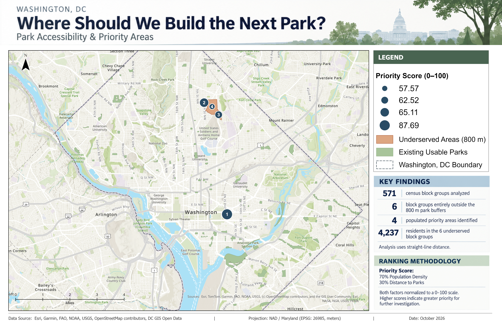
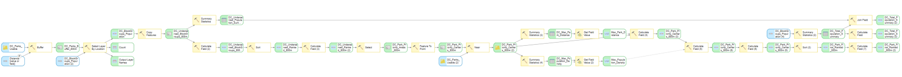

# Where Should We Build the Next Park?

### Washington, DC | Park Accessibility & Priority Analysis

A reproducible GIS screening project identifying Washington, DC census block groups entirely outside an 800-meter straight-line buffer of existing usable parks, then ranking populated underserved areas by population density and proximity to parks.

**Tools:** ArcGIS Pro · ModelBuilder · ArcPy (planned extension) · GIS geoprocessing · U.S. Census/ACS data · GitHub

## Final Map



> **Image setup:** Update the filename in the link above to match the actual PNG in `outputs/` if different.

## At a Glance

| Measure | Result |
|---|---:|
| Usable park polygons | 147 |
| Census block groups evaluated | 571 |
| Total population represented | 681,294 |
| Block groups entirely outside 800 m park buffers | 6 |
| Residents in those six block groups | 4,237 |
| Populated underserved areas ranked | 4 |
| Priority score weights | 70% population density / 30% park distance |

**Interpretation:** The 4,237 figure is the total population of six block groups entirely outside the buffers, not a person-level count derived from walking routes. The four priority points are representative locations for further investigation, **not confirmed buildable park sites**.

## Planning Questions

1. Which DC census block groups do not intersect an 800-meter buffer around usable parks?
2. How many residents live in those block groups?
3. Which populated underserved areas rank highest when considering population density and distance to existing parks?
4. How can the analysis be structured as a repeatable GIS workflow?

## Data and Preparation

| Input | Role |
|---|---|
| Washington, DC park polygons | Existing usable parks and accessibility buffers |
| Washington, DC boundary | Study-area boundary and map context |
| U.S. Census block-group polygons | Geographic units for accessibility screening |
| 2024 ACS 5-year population estimates | Total population by block group |
| Esri topographic basemap | Context for the final presentation map |

All analytical layers were prepared in **NAD83 / Maryland (EPSG:26985)**, with distances measured in meters. The preparation process included filtering the parks layer to 147 usable polygons, preparing 571 block groups, joining ACS population estimates, and checking numeric population fields and spatial references.

**Reproducibility note:** Add the exact source URLs, ACS table/variable identifiers, download dates, and filtering criteria here before presenting the repository as fully reproducible. Source data and geodatabases may be excluded from version control because of size or licensing considerations.

## Analysis Workflow

### 1. Define park coverage

Create **800-meter planar buffers** around usable park polygons and **dissolve all** buffers into a combined coverage area. This is **Euclidean (straight-line) proximity**, not pedestrian-network travel distance.

### 2. Screen underserved block groups

Use **Select Layer By Location** with `INTERSECT` and an inverted selection to identify block groups that **do not intersect** the dissolved buffer. Six of 571 block groups meet this strict screening condition.

This rule excludes block groups that overlap a buffer even if part of their area lies beyond 800 meters. It therefore does not capture every potentially underserved resident or location.

### 3. Identify populated candidates

Select underserved block groups with population greater than zero. Four of the six block groups remain as ranked candidate areas. Create a representative point within each polygon using **Feature To Point** with the **INSIDE** option.

### 4. Measure distance and density

Use **Near** to measure straight-line distance from each representative point to the nearest usable park polygon. Calculate population density:

```text
Population density (people/km²) = Block-group population / Block-group area (km²)
```

### 5. Normalize and score

Normalize population density and distance relative to the **maximum observed value among the four candidates**:

```text
Density score  = 100 × (candidate density / maximum candidate density)
Distance score = 100 × (candidate distance / maximum candidate distance)
Priority score = 0.70 × Density score + 0.30 × Distance score
```

This is **maximum-based scaling**, not min-max normalization. The weights express a planning assumption, not an empirically validated optimum. Scores can change if the candidate set or weights change.

### 6. Rank and map

Rank the four populated candidate areas from highest to lowest priority and present them alongside parks, the study boundary, and underserved block groups.

## ModelBuilder Automation

The ArcGIS Pro ModelBuilder workflow connects spatial screening, population filtering, representative point generation, distance calculations, normalization, scoring, and ranking. **Summary Statistics** and **Get Field Value** retrieve maximum values dynamically, reducing the need to hard-code normalization constants.

Key benefits include consistent parameters, repeatable processing, visible dependencies, and easier inspection of intermediate results.

### ModelBuilder Overview



*Replace this image with a readable, tightly cropped overview. If the complete model is too dense, use two or three detailed screenshots in the `screenshots/` folder and link to them below.*

<!-- Optional detail images after capturing them:


-->

## Results

Four populated block groups were ranked as preliminary park-planning priorities.

| Priority rank | Approx. priority score |
|---:|---:|
| 1 | 87.69 |
| 2 | 65.11 |
| 3 | 62.52 |
| 4 | 57.57 |

The representative priority points are approximately **967–1,397 meters** from their nearest usable park polygons. These point-to-park distances should not be interpreted as walking distances or as the minimum distance from every location within each block group.

## Limitations and Next Steps

- **Straight-line distance:** Buffer and Near analyses do not account for sidewalks, road crossings, entrances, barriers, or travel time.
- **Geographic screening:** Only block groups entirely outside buffers are selected; partially covered block groups are not evaluated for their uncovered populations.
- **Population distribution:** Block-group totals do not show where individual residents live within each polygon.
- **Park definition:** Results depend on which source park features are considered usable and whether public access is accurately represented.
- **Scoring assumptions:** A 70/30 weighting and maximum-based normalization are scenario choices; sensitivity testing is needed.
- **Site feasibility:** Priority points do not identify vacant, publicly owned, appropriately zoned, or otherwise feasible construction parcels.
- **Data vintage:** Population estimates and park inventories may reflect different reporting periods.

Potential improvements include **walkable street-network service areas**, park entrance locations, finer-grained population allocation, equity and environmental indicators, land availability screening, and sensitivity analysis for scoring weights.

## Repository Structure

```text
DC_Park_Accessibility_Planner/
├── arcgis_pro/       # ArcGIS Pro project files, where shared
├── arcpy/            # ArcPy automation and related scripts
├── data/             # Input/reference data or acquisition notes
├── docs/             # Methodology and supporting documentation
├── modelbuilder/     # ModelBuilder exports and documentation
├── outputs/          # Final map exports (PNG/PDF)
├── screenshots/      # ModelBuilder and workflow screenshots
├── scripts/          # Supporting utilities
├── .gitignore
└── README.md
```

The presence of a folder does not necessarily mean its automation or documentation is complete. Keep only files appropriate for public distribution in the repository.

## How to Reproduce

1. Install **ArcGIS Pro** with the geoprocessing tools used in the workflow.
2. Obtain the source parks, boundary, block-group, and ACS population datasets; document their exact versions and download sources.
3. Project analysis features to **EPSG:26985** and join population data to the correct block-group identifiers.
4. Apply the documented usable-park filter and validate input feature counts.
5. Run the ModelBuilder workflow using an **800-meter** buffer distance.
6. Validate the six underserved block groups, four populated candidates, calculated scores, and map outputs.

**Status:** The ArcGIS Pro/ModelBuilder analysis and cartographic exports are complete. Script-based reproduction instructions will be expanded when the ArcPy implementation is included in the repository.

## Project Repository

[DC Park Accessibility Planner on GitHub](https://github.com/namozhdehi/DC_Park_Accessibility_Planner)


## ArcGIS Pro Project Dependencies

The repository includes the ArcGIS Pro project (`.aprx`) and ModelBuilder toolbox (`.atbx`) for reviewing the GIS workflow.

The original working project uses an Esri file geodatabase named `DC_Park_Accessibility_Planner.gdb`, which is excluded from GitHub to avoid committing generated spatial datasets and temporary geodatabase files.

The repository includes ACS population data and final cartographic outputs, but it does not currently contain every spatial input and intermediate feature class required to execute the model independently.

### Opening the Project

1. Download or clone this repository.
2. Open `arcgis_pro/DC_Park_Accessibility_Planner.aprx` in ArcGIS Pro.
3. If layers display broken data-source links, reconnect them to the appropriate local datasets.
4. Review the ModelBuilder toolbox in `modelbuilder/DC_Park_Accessibility_Planner.atbx`.

The project currently serves as a documented GIS portfolio artifact rather than a fully self-contained executable package.

A future ArcPy implementation will support parameterized processing and improve reproducibility.
